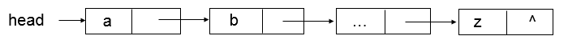
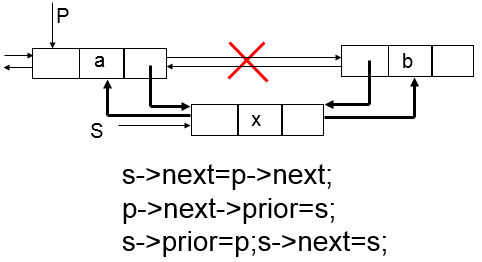

# 算法分析

## 算法时间复杂度

在进行算法分析时，语句总的执行次数 $T (n)$ 是关于问题规模 n 的函数，进而分析 $T (n)$ 随 n 的变化情况并确定 $T (n)$ 的数量级。算法的时间复杂度，记作： $T (n)$ = $O(f(n))$。它表示随问题规模 n 的增大，算法执行时间的增长率和  $f (n)$ 的增长率相同，称作算法的渐进时间复杂度，简称为时间复杂度。其中 $f (n)$ 是问题规模 n 的某个函数。

这种用大写 $O ()$ 来体现算法时间复杂度的记法，我们称之为大 O 记法。下面是几种推导方法：

1. 用常数 1 取代运行时间中的所有加法常数。
2. 在修改后的运行次数函数中，只保留最高阶项。
3. 如果最高阶项存在且不是 1，则去除与这个项相乘的常数。

常用的时间复杂度所耗费的时间从小到大依次是：
$$
O(1)<O(logn)<O(n)<O(nlogn)<O(n^2)<O(n^3)<O(2^n)<O(n!)<O(n^n)
$$

### 常数阶

```c++
int sum =0,n = 100;   //执行一次
sum = (1+n)*n/2;	 //执行一次
cout<<sum;			//执行一次
```

这个算法的运行次数函数是 $f(n)=3$ ，时间复杂度为 $O(1) $。

### 线性阶

```c++
for(int i=0;i<n;i++)
{
  //时间复杂度为O(1)的程序步骤序列
}
```

### 对数阶

```c++
int cnt=1;
while(cnt<n)
{
  cnt=cnt*2;
  //时间复杂度为O(1)的程序步骤序列
}
```

有多少个 2 相乘后大于 n，则会退出循环。所以这个循环的时间复杂度为 $ O(log_2n) $。

### 平方阶

```c++
for(int i=0;i<n;i++)
{
  for(int j=0;j<m;j++)
  {
    //时间复杂度为O(1)的程序步骤序列
  }
}
```

时间复杂度为 $O(m\times n)$。

```c++
for(int i=0;i<n;i++)
{
  for(int j=i;j<n;j++)
  {
    //时间复杂度为O(1)的程序步骤序列
  }
}
```

总的执行次数为 $\frac{n^2}{2}+\frac{n}{2}$，首先保留最高阶项 $\frac{n^2}{2}$，然后去除这个项相乘的常数，最终时间复杂度为 $O(n^2)$。

## 算法空间复杂度

# 线性表

线性表是具有相同特性数据元素的一个有限序列。其中元素有且仅有一个直接后继，有且仅有一个直接前驱。

## 顺序存储结构

线性表的顺序存储结构，指的是用一段地址连续的存储单元一次存储线性表的数据元素。它在存、读取数据时，不管是在哪个位置，时间复杂度都是 $O(1)$；而插入或删除时，时间复杂度都是 $O(n)$。

**优点：**

- 无须为表示表中元素之间的逻辑关系而增加额外的存储空间
- 可以快速地存取表中任一位置的元素

**缺点：**

- 插入和删除操作需要移动大量元素
- 当线性长度变化较大时，难以确定存储空间的容量
- 造成存储空间的“碎片”。

### 顺序表


## 链式存储结构

线性表的链式存储结构，指的是用一组任意的存储单元存储线性表的数据元素，这组存储单元可以是连续的，也可以是不连续的。在链式结构中，除了要存数据元素信息外，还要存储它直接后继元素或着直接前驱元素的存储地址。

**头指针：**

- 头指针是指链表指向第一个结点的指针，若链表有头结点，则是指向头结点的指针
- 无论链表是否为空，头指针均不为空，头指针是链表的必要元素。

**头结点：**

- 头结点是为了操作的统一和方便而设立的，放在第一个元素的结点之前，其数据域一般无意义，也可以存储链表的长度。
- 有了头结点，对在第一元素结点前插入结点和删除第一结点，其操作与其它结点的操作就统一了。

### 单链表

单链表查找的时间复杂度是 $O(n)$，在不知道第 i 个元素的指针位置时，单链表在插入和删除操作上时间复杂度是 $O(n)$。我们只需要在第一次时，找到第 i 个元素的指针位置，此时为 $O(n)$，接下来只是简单的通过赋值移动指针而已，时间复杂度都是 $O(1)$。单链表不需要分配存储空间，只要有就可以分配，元素个数也不受限制。若需要频繁插入和删除时，宜采用单链表结构。若需要频繁查找，很少进行插入和删除操作时，宜采用顺序存储结构。



插入


删除


### 双链表

在单链表的每个结点中，再设置一个指向其前驱结点的指针域，这样的链表叫作双链表。


插入



删除


### 循环链表

将链表中尾结点的指针由空指针改为指向头结点，就使整个链表形成一个环，这种头尾相接的链表称为循环链表。


# 栈和队列

## 栈

栈是限定仅在表尾进行插入和删除操作的线性表，又称为**后进先出**的线性表。我们把允许插入和删除的一端称为栈顶，另一端称为栈底。

栈的应用：递归，四则运算，软件应用的返回等等。


### 顺序栈

### 链式栈

对比一下顺序栈与链式栈，它们在时间复杂度是一样的，均为 $O(1)$。顺序栈可能会存在内存空间浪费的问题，但它的优势是存取时定位很方便，而链式栈每个元素都有指针域，这同时也增加了一些内存开销，但对于栈的长度无限制。

## 队列

队列是只允许在一端进行插入操作，而在另一端进行删除操作的线性表。队列是一种**先进先出**的线性表，允许插入的一端称为队尾，允许删除的一端称为队头。


### 顺序队列

### 链式队列

### 循环队列

在非循环队列中，元素入队时队尾指针 rear 加 1，元素出队时队头指针 front 加 1，当入队 MaxSize 个元素后，满足队满的条件（即 rear == MaxSize-1 成立），此时即使出队若干元素，队满条件仍然成立，这是一种假溢出。

为了解决假溢出情况，把数组的前端和后端连接起来，形成一个循环的顺序队列，即循环队列。

- 队头指针进1：front = (front + 1) % MaxSize;
- 队尾指针进1：rear = (rear + 1) % MaxSize;

#### 队满、队空判定条件？

1. 加设标志位，让删除动作使其为 1，插入动作使其为 0，则可识别当前 front = rear。
2. 人为浪费一个单元，令循环队列队满的条件为 (rear+1) % MaxSize == front，队空条件为 rear == front。
3. 使用一个计数器记录队列中元素个数。

入队操作的时间复杂度是 $O(1)$，出队操作的时间复杂度是 $O(n)$。顺序队列会出现假溢出现象，解决这个问题可以采用头尾相接的循环队列。但循环队列也会面临着数组可能会溢出的问题，所以可以采用不需要担心队列长度的链式存储结构。

对于循环队列与链式队列的比较，起始它们基本操作的时间复杂度都是 $O(1)$，不过循环队列是事先申请好空间，使用期间不释放，而对于链式队列，每次申请和释放结点也会存在一些时间开销。总的来说，在可以确定队列长度最大值的情况下，建议用循环队列。

# 串

串是由零个或多个字符组成的有限序列，又名叫字符串。串的链式存储结构除了在连接串和串操作时有一定方便之外，总的来说不如顺序存储灵活，性能也不如顺序存储结构好。

## BF 模式匹配算法

又称古典或经典的、朴素的、穷举的模式匹配算法，BF 算法设计思想：

- 将主串的第 i 个字符和模式的第 1 个字符比较，若相等，继续逐个比较后续字符；若不等，从主串的下一字符 (i+1) 起，重新与第一个字符比较。
- 直到主串的一个连续子串字符序列与模式相等 。返回值为 S 中与 T 匹配的子序列第一个字符的序号，即匹配成功。否则，匹配失败，返回值 0 .  

BF匹配算法的最坏时间复杂度是 $O(n*m)$，最好情况下的时间复杂度是 $O(n+m)$。

## KMP 模式匹配算法

BF 算法效率低！子串和主串的指针都需要回溯！而 KMP 算法速度快，主串指针不回溯，时间复杂度是 $O(n+m)$。

```c++
//通过计算返回串 T 的 next 的数组。
void get_next(string T,int *next)
{
    int i,j;
  	i=1;j=0;
  	next[1]=0;
  	while(i<T[0])	//此处 T[0] 表示串 T 的长度
    {
      	if(j==0 || T[i]==T[j])	//T[i] 表示后缀的单个字符，T[j] 表示前缀的单个字符
        {
        	i++;
          	j++;
          	next[i]=j;
          	/*
          	if(T[i]!=T[j])
          		nextval[i]=j;
          	else
          		nextval[i]=nextval[j];
          	*/
        }
      	else
          	j=next[j];	//若字符不相同，则 j 值回溯
      		//j=nextval[j];
    }
}

int Index_KMP(string s,string T,int pos)
{
  int i=pos;//用于主串 s 当前位置下标值，若 pos 不为 1，则从 pos 位置开始匹配
  int j=1;	//用于子串 T 中当前位置下标值
  int next[255];
  get_next(T,next);
  while(i<=s[0] && j<=T[0])	//若i小于s的长度且j小于T的长度时，循环继续
  {
    if(j==0 || s[i]==T[j])	//两字母相等则继续
    {
      i++;
      j++;
    }
    else
      j=next[j];	
  }
  if(j>T[0])
    return i-T[0];
  else
    return 0;
}
```

# 树

树是 n 个结点的有限集合。n=0 时称为空树。在任意一颗非空树中：

- 有且仅有一个特定的称为根的结点
- 当 n>1 时，其余结点可分为 m 个互不相交的有限集，其中每一个集合本身又是一棵树，并且称为根的子树

结点拥有的子树称为结点的度，树的度是树内各结点的度的最大值。结点的层次从根开始定义起，根为第一层，根的孩子为第二层。树中结点的最大层次称为树的深度。

## 二叉树

二叉树是 n 个结点的有限集合，由一个根结点和两颗互不相交的、分别称为根结点的左子树和右子树的二叉树组成。二叉树的结构最简单，规律性最强。可以证明，所有树都能转为唯一对应的二叉树。

二叉树的特点：

- 每个结点最多有两颗子树，
- 左子树和右子树是有顺序的，
- 即使树中某结点只有一颗子树，也要区分它是左子树还是右子树。

二叉树的性质：

- 在二叉树的第 i 层上至多有 $2^{i-1}$ 个结点，
- 深度为 k 的二叉树至多有 $2^k-1$ 个结点，
- 对任何一颗二叉树 T，如果其终端结点数为 $n_0$，度为 2 的结点数为 $n_2$，则 $n_0=n_2+1$，
- 具有 n 个结点的完全二叉树的深度为 $|log_2n|+1$ ( $|x|$ 表示不大于 x 的最大整数)，
- 如果对一颗有 n 个结点完全二叉树（其深度为 $|log_2n|+1$）的结点按层序编号，对任一结点 i 有：
  1. 如果 $i=1$，则结点 i 是二叉树的根；如果 $i>1$ ，则其双亲是结点$|i/2|$，
  2. 如果 $2i>n$，则结点 i 无左孩子；否则其左孩子是结点 $2i$,
  3. 如果$2i+1>n$，则结点 i 无左孩子；否则其右孩子是结点 $2i+1$。

## 特殊二叉树

### 1 斜树

所有的结点都只有左子树的二叉树叫左斜树，所有结点都是只有右子树叫右斜树。

### 2 满二叉树

在一颗二叉树中，如果所有分支结点都存在左子树和右子树，并且所有叶子都在同一层上，这样的二叉树称为满二叉树。

### 2 完全二叉树

对一颗具有 n 个结点的二叉树按层序编号，如果编号为 i 的结点与同样深度的满二叉树中编号为 i 的结点在二叉树中位置完全相同，则这颗二叉树称为完全二叉树。


完全二叉树的特点：

- 叶子结点只能出现在最下两层
- 最下层的叶子一定集中在左部连续位置
- 倒数第二层，若有叶子结点，一定都在右部连续位置
- 如果结点度为 1 ，则该结点只有左孩子。
- 同样结点数的二叉树，完全二叉树的深度最小。

## 遍历二叉树

- 先序遍历
  1. 访问根结点
  2. 访问左结点
  3. 访问右结点
- 中序遍历
  1. 访问左结点
  2. 访问根结点
  3. 访问右结点
- 后序遍历
  1. 访问左结点
  2. 访问右结点
  3. 访问根结点
- 层序遍历
  1. 从根结点开始
  2. 按从上到下、从左到右的次序访问树中的每一个结点

```c++
void PreOrderTraverse(BiTree T)
{
  if(T==NULL)
    return;
  cout<<T->data;
  PreOrderTraverse(T->lchild);
  PreOrderTraverse(T->rchild);
}

void InOrderTraverse(BiTree T)
{
  if(T==NULL)
    return;
  InOrderTraverse(T->lchild);
  cout<<T->data;
  InOrderTraverse(T->rchild);
}

void PostOrderTraverse(BiTree T)
{
  if(T==NULL)
    return;
  PostOrderTraverse(T->lchild);
  PostOrderTraverse(T->rchild);
  cout<<T->data;
}
```

## 线索二叉树

二叉树链表有时存在许多空指针域，这样就白白浪费了内存资源。在二叉树链表上，我们只知道每个结点指向其左右孩子结点的地址，而不知道某个结点的前驱是谁、后继是谁。要想知道，必须每回遍历一次。

若把指向前驱和后继的指针存在二叉树链表的空指针域，并加上标志位，这样的二叉树链表称为线索二叉树。


其中：

- 若结点有左子树，则 lchild 指向其左孩子，lTag 为 0；否则，lchild 指向其直接前驱 (即线索)，lTag 为 1；
- 若结点有右子树，则 rchild 指向其右孩子，rTag 为 0；否则，rchild 指向其直接后继 (即线索)，rTag 为 1。

它充分利用了空指针域的空间，又保证了创建时的一次遍历就可以终生受用前驱后继的信息。如果所用的二叉树需经常遍历或查找结点时需要某种遍历序列中的前驱和后继，那么采用线索二叉树的链表存储结构就是非常不错的选择。

## 树、森林与二叉树的转换

### 树转换为二叉树

1. 加线。在所有兄弟结点之间加一条连线
2. 去线。对树中每个结点，只保留它与第一个孩子结点的连线，删除它与其它孩子结点之间的连线。
3. 层次调整。注意第一个孩子是二叉树结点的左孩子，兄弟转换过来的孩子是结点的右孩子。

### 森林转换为二叉树

1. 把每个树转换为二叉树。
2. 第一课二叉树不动，从第二课二叉树开始，依次把后一颗二叉树的根结点作为前一颗二叉树的根结点的右孩子，用线连接起来。当所有的二叉树连接起来后就得到了由森林转换而来的二叉树。

### 二叉树转换为树

1. 加线。左孩子的 n 个右孩子结点都作为此结点的孩子。将该结点与这些右孩子结点用线连接起来。
2. 去线。删除原二叉树中所有结点与其右孩子结点的连线。
3. 层次调整。使之结构层次分明。

### 二叉树转换为森林

1. 从根结点开始，若右孩子存在，则把与右孩子结点的连线删除，再查看分离后的二叉树，若右孩子存在，则连线删除……，直到所有右孩子连线都删除为止，得到分离的二叉树。
2. 再将每颗分离后的二叉树转换为树即可。

## 哈夫曼树(David Huffman)

从树中一个结点到另一个结点之间的分支构成两个结点之间的路径，路径上的分支数目称做路径长度。树的路径长度就是从树根到每一结点的路径长度之和。如果考虑到带权的结点，结点的带权的路径长度为从该结点到树根之间的路径长度与结点上权的乘积。带权路径长度 **WPL** 最小的二叉树称做**哈夫曼树**。

哈夫曼树算法描述：

1. 先把有权值的叶子结点按照从小到大的顺序排列，
2. 取两个最小权值的结点作为一个新结点的两个子结点，相对较小的是左孩子，
3. 将新结点与剩下的结点重新排序
4. 重复 2, 3，直到只含一棵树为止，这颗树便是哈夫曼树。

# 图

图是由顶点的有穷非空集合和顶点之间边的集合组成，通常表示为：$G(V,E)$，$G$ 表示一个图，$V$ 是图 $G$ 中顶点的集合，$E$ 是图 $G$ 中边的集合。

**无向边：**若顶点 $v_i$ 到 $v_j$ 之间的边没有方向，则称这条边为无向边 (Edge)，用无序偶对 $(v_i,v_j)$ 来表示。如果图中任意两个顶点之间的边都是无向边，则称该图为无向图。

**有向边：**若从顶点 $v_i$ 到 $v_j$ 之间的边有方向，则称这条边为有向边，也称为弧 (Arc)。用有序偶对 $<v_i,v_j>$ 来表示，$v_i$ 称为弧尾 (Tail)，$v_j$ 称为弧头 (Head)。如果图中任意两个顶点之间的边都是有向边，则称该图为有向图。

在图中，若不存在顶点到其自身的边，且同一条边不重复出现，则称这样的图为**简单图**。在无向图中，如果任意两个顶点之间都存在边，则称该图为**无向完全图**。在有向图中，如果任意两个顶点之间都存在方向互为相反的两条弧，则称该图为**有向完全图**。

有些图的边或弧具有与它相关的数字，这种与图的边或弧相关的数叫做权，而带权的图通常称为**网**。

对于无向图，顶点 $v$ 的度是和 $v$ 相关联的边的数目。对于有向图，以顶点 $v$ 为头的弧的数目称为 $v$ 的入度，以顶点 $v$ 为尾的弧的数目称为 $v$ 的出度，顶点 $v$ 的度为入度与出度之和。

在无向图中，任意两个顶点 $v_i、v_j \in V$，$v_i$ 和 $v_j$ 都是连通的，则称为**连通图**。无向图中的极大连通子图称为**连通分量**。在有向图中，如果对于每一对 $v_i、v_j \in V、v_i \ne v_j$，从 $v_i$ 到 $v_j$ 和从 $v_j$ 到 $v_i$ 都存在路径，则称为**强连通图**。有向图中极大强连通子图称做有向图的**强连通分量**。

## 图的存储结构

图的**邻接矩阵**存储方式是用两个数组来表示图。一个一维数组存储图中顶点信息，一个二维数组（称为邻接矩阵）存储图中的边或弧的信息。

设图 $G$ 有 $n$ 个顶点，则邻接矩阵是一个 $n\times n$ 的方阵，定义为：
$$
arc[i][j]=\begin{cases} 1& 若(v_i,v_j)\in E \text{或} <v_i,v_j> \in E \\
0& \text{反之} \end{cases}
$$


有了这个矩阵，我们就可以很容易地直到图中的信息了：

1. 无向图的邻接矩阵是对称的；
2. 顶点 $v_i$ 的度等于第 $i$ 行 (列) 中 1 的个数。


在有向图的邻接矩阵中：

- 第 $i$ 行含义：以结点 $v_i$ 为尾的弧(即出度边）；
- 第 $i$ 列含义：以结点 $v_i$ 为头的弧(即入度边）。

设图 G 是网图，有 n 个顶点，$W_{ij}$ 表示 $(v_i,v_j)$ 或 $<v_i,v_j>$ 上的权值，则邻接矩阵是一个 $n\times n$ 的方阵，定义为：
$$
arc[i][j]=\begin{cases} W_{ij}& 若(v_i,v_j)\in E \text{或} <v_i,v_j> \in E \\
0& \text{若} i=j\\
\infty& \text{反之}\end{cases}
$$


**邻接矩阵法优点：**容易实现图的操作，如：求某顶点的度、判断顶点之间是否有边（弧）、找顶点的邻接点等等。

**邻接矩阵法缺点：**n 个顶点需要 $n\times n$ 个单元存储边(弧)；空间效率为$O(n^2)$ 。对稀疏图而言尤其浪费空间。

### 图的存储结构表示

我们在树中谈存储结构时，讲到了一种孩子表示法，将结点存入数组，并对结点的孩子进行链式存储，不管有多少孩子，也不会存在空间浪费问题。我们把这种数组与链表相结合的存储方法称为邻接表。

- 图中顶点用一个一维数组存储，也可以用单链表来存储。另外，对于顶点数组中，每个数据元素还需要存储指向第一个邻接点的指针，以便于查找该顶点的边信息。
- 图中每个顶点 $v_i$ 的所有邻接点构成一个线性表，由于邻接点的个数不定，所以用单链表存储，无向图称为顶点 $v_i$ 的边表，有向图则称为顶点 $v_i$ 作为弧尾的出边表。有时，为了便于确定顶点的入度，可以建立一个有向图的逆邻接表。
- 边结点通常被定义为 3 个域：
  - 一是邻接点域 (adjvex)，用于存储邻接点
  - 二是权域，用于存储边的权值，可根据情况舍去
  - 三是链域，用于链接顶点 $v_i$ 邻接表中下一个结点

```c++
#define MAX_VERTEX_NUM 20  					//假设的最大顶点数
Typedef  struct  ArcNode {   
      int  adjvex;                            //该弧所指向的顶点位置
      struct  ArcNode *nextarcs; 			//指向下一条弧的指针
      InfoArc    *info;                    	//该弧相关信息的指针
} ArcNode；

Typedef   struct  VNode{                 	//顶点结构
     VertexType   data;          			//顶点信息
     ArcNode   * firstarc;       			//指向依附该顶点的第一条弧的指针
}VNode, AdjList[  MAX_VERTEX_NUM ];  

Typedef   struct {                 			//图结构
     AdjList   vertics ;         			//应包含邻接表
      int  vexnum, arcnum; 					//应包含顶点总数和弧总数
      int  kind;                      		//还应说明图的种类（用标志）
}ALGraph;  								//图结构
//对于n个顶点e条边的无向图，邻接表中除了n个头结点外，只有2e个表结点；在有向图中，邻接表中除了n个头结点外，只有e个表结点
//空间效率为O(n+2e)或O(n+e)
//时间效率为O(n+e*n)
```

**邻接表的优点：**空间效率高，容易寻找顶点的邻接点；

**邻接表的缺点**：判断两顶点间是否有边或弧，需搜索两结点对应的单链表，没有邻接矩阵方便。

### 十字链表

十字链表的好处就是因为把邻接表和逆邻接表整合在一起了，这样既容易找到以 $v_i$ 为尾的弧，也容易找到以 $v_i$ 为头的弧，所以容易求得顶点的出度和入度。而且它除了结构复杂一点外，其实创建图算法的时间复杂度和邻接表相同。

它们的顶点表结构由 3 个域组成：

- vertex 域存储与顶点相关的信息
- firstin 指向以该顶点为弧头的第一个弧结点
- firstout 指向以该顶点为弧尾的第一个弧结点

而它们的弧结点中

- 尾域 tailvex 和头域 headvex 分别指示弧尾和弧头
- 链域 hlink 指向弧头相同的下一条弧
- 链域 tlink 指向弧尾相同的下一条弧

### 邻接多重表

用于优化无向图的邻接表，顶点表由两个域组成，vertex 域存储和该顶点相关的信息，指针 firstedge 指向第一条依附该顶点的边。边表结点由 6 个域组成：

- mark 为标记域，可用以标记该边是否被搜索过
- ivex 和 jvex 为该边依附的两个顶点在图中的位置
- ilink 指向下一条依附于顶点 ivex 的边
- jlink 指向下一条依附于顶点 jvex 的边
- info 存储相关信息

### 边集数组

边集数组是由两个一维数组构成。一个是存储顶点的信息；另一个是存储边的信息，这个边数组每个数据元素由一条边的起点下标、终点下标和权组成。

## 图的遍历

### 深度优先遍历（DFS）

它从图中某个顶点 $v$ 出发，访问此顶点，然后从 $v$ 的未被访问的邻接点出发深度优先遍历图，直至图中所有和 $v$ 有路径相通的顶点都被访问到。


```c++
//邻接矩阵
void DFS()
{
    
}
```

```c++
//邻接表
void DFS()
{
  
}
```

### 广度优先遍历（BFS）

广度优先遍历是一种分层的搜索过程，在访问了起始点 $v_i$ 之后，依次访问 $v_i$ 的邻接点；然后再依次访问这些顶点中未被访问过的邻接点；直到所有顶点都被访问过为止。


```c++
//邻接矩阵
void BFS()
{
    
}
```

```c++
//邻接表
void BFS()
{
  
}
```

## 最小生成树

生成树是一个极小连通子图，它含有图中全部顶点，但只有 n-1 条边。对连通图进行遍历，得到的将是一个极小连通子图，即图的生成树！对非连通图进行遍历，得到的将是各连通分量的生成树，即图的生成森林！

n 个顶点的生成树很多，需要从中选一棵代价最小的生成树，即该树各边的代价之和最小。此树便称为最小生成树 MST (Minimum cost Spanning Tree)。

### 克鲁斯卡尔算法（Kruskal）

设 $N= \{ V, E\}$ 是有 n 个顶点的连通网

**步骤：**

1. 首先构造一个只有 n 个顶点但没有边的非连通图 $T= \{ V,\emptyset\}$ ，图中每个顶点自成一个连通分量。

2. 当在边集 E 中选到一条具有最小权值的边时,若该边的两个顶点落在 T 中不同的连通分量上，则将此边加入到生成树的边集合 T 中；否则将此边舍去，重新选择一条权值最小的边。

3. 如此重复下去，直到所有顶点在同一个连通分量上为止。此时的 T 即为所求（最小生成树）。

   


克鲁斯卡尔算法特点是将边归并，适于求稀疏网的最小生成树，故采用邻接表作为图的存储表示。

### 普里姆算法（Prim）

设：$N=\{V, E\}$ 是个连通网，另设 U 为最小生成树的顶点集，TE 为最小生成树的边集。

**步骤:**

1. 初始状态：$U =\{u_0 \}, (u_0∈V)，TE=\{  \}$ ;
2. 从 E 中选择顶点分别属于 U、V-U 两个集合、且权值最小的边 $(u_0, v_0)$ ，将顶点 $v_0$ 归并到集合 U 中，边$(u_0, v_0)$ 归并到 TE 中；
3. 直到 U=V 为止。此时TE中必有 n-1 条边，$T＝(V，\{TE\})$ 就是最小生成树。

普里姆算法算法特点是将顶点归并，与边数无关，适于稠密网。故采用邻接矩阵作为图的存储表示。


## 最短路径

### 迪杰斯特拉算法 (Dijkstra)

这是一种按路径长度递增的次序产生最短路径的算法。并不是一次求出 $v_s$ 到 $v_e$ 的最短路径，而是一步步求出它们之间顶点的最短路径，在已经求出的最短路径的基础上，求得更远顶点的最短路径。算法复杂度 $O(n^3)$……

#### 算法思想

把 $V$ 分成两组：

- $S$：已求出最短路径的顶点的集合
- $V-S=T$：尚未确定最短路径的顶点集合

将 $T$ 中顶点按最短路径递增的次序加入到 $S$ 中，保证：

- 从源点 $v_0$ 到 $S$ 中各顶点的最短路径长度都不大于从 $v_0$ 到 $T$ 中任何顶点的最短路径长度
- 每个顶点对应一个距离值
  - $S$ 中顶点：从 $v_0$ 到此顶点的最短路径长度
  - $T$ 中顶点：从 $v_0$ 到此顶点的只包括 $S$ 中顶点作中间顶点的最短路径长度

引进一个辅助数组 $Dist$，该数组的每个元素 $Dist[v_i]$ 表示当前所找到的从始点 $v$ 到每个终点 $v_i$ 的最短路径的长度 $(i=1,2,\dots,n)$。

$Dijkstra$ 算法有一个明显的不足：当边的权值为负时，该算法不适用？

### Bellman-Ford 算法

Bellman-Ford 算法是求含负权图的单源最短路径算法，效率比较低，但算法比较简单。

### 弗洛伊德算法 (Floyd)

逐个顶点试探法，算法复杂度 $O(n^3)$……

#### 求最短路径步骤

- 初始时设置一个 n 阶方阵，令其对角线元素为 0，若存在弧 $<v_i,v_j>$，则对应元素为权值；否则为 $\infty$
- 逐步试着在原直接路径中增加中间顶点，若加入中间点后路径变短，则修改之；否则，维持原值
- 所有顶点试探完毕，算法结束

```c++
Floyd(int cost[][],int n)
{
    for(i=1;i<=n;i++)
      for(j=1;j<=n;j++)
        {
          	a[v_i][v_j]=cost[v_i][v_j];
        	path[v_i][v_j]=0;
        }
  	for(k=1;k<=n;k++)
      for(i=1;i<=n;i++)
      	for(j=1;j<=n;j++)
          if(a[v_i][v_k]+a[v_k][v_j]<a[v_i][v_j])
        	{
          		a[v_i][v_j]=a[v_i][v_k]+a[v_k][v_j];
        		path[v_i][v_j]=k;
        	}
}
//cost[v_i][v_j] 表示弧 (v_i,v_j) 上的权值
//a[v_i][v_j] 存放从顶点 v_i 到顶点 v_j 的最短路径的长度
//path[v_i][v_j] 存放从顶点 v_i 到顶点 v_j 最短路径上的所有中间顶点。
```

## 拓扑排序

在有向图中，用顶点表示活动，用弧表示活动之间的优先关系，这样的有向图称为顶点表示活动的网 (**Activity On Vertex Network**)，简称 **AOV**。**AOV** 网中不允许有回路，回路意味着某项活动以自己为先决条件。

设 $G=\{V,E\}$ 是一个具有 n 个顶点的有向图，$V$ 中的顶点序列 $v_1,v_2,\dots,v_n$, 满足若从顶点 $v_i$ 到 $v_j$ 有一条路径，则在顶点序列中顶点 $v_i$ 必在顶点 $v_j$ 之前，则我们称这样的顶点序列为一个**拓扑序列**。

把 **AOV** 网络中各顶点按照它们相互之间的优先关系排列成一个线性序列的过程叫**拓扑排序**。

### 拓扑排序的方法

- 在有向图中选一个没有前驱的顶点且输出之
- 从图中删除该顶点和所有以它为尾的弧
- 重复上述两步，直至全部顶点均已输出；或者当图中不存在无前驱的顶点为止

约定：对于同时有入度为 0 的若干结点，编号小的靠前排。

## 关键路径

在一个表示工程的带权有向图中，用顶点表示事件，用有向边表示活动，用边上的权值表示活动的持续时间，这种有向图的边表示活动的网，我们称之为 **AOE** 网 (**Activity On Edge Network**)。

我们把路径上各个活动持续的时间之和称为**路径长度**，从源点到汇点具有最大长度的路径叫**关键路径**，在关键路径上的活动叫**关键活动**。

**AOE** 网的性质：

- 只有在某个顶点所代表的事件发生后，从该顶点出发的各有向边所代表的活动才能开始。
- 只有在进入某点的各有向边所代表的活动都已结束，该顶点所代表的事件才能发生。

### 关键路径算法

1. 对图进行拓扑排序，若不能进行拓扑排序则退出。
2. 按拓扑序列顺序，从前向后搜索寻找活动边，计算相应事件的最早开始时间。
3. 按拓扑序列顺序，从后向前搜索寻找活动边，计算相应事件的最迟开始时间。
4. 计算各活动的最早开始时间和最迟开始时间
5. 求出关键事件和关键活动

# 查找

## 有序表查找

### 二分查找

在有序表中，取中间记录作为比较对象，若给定值与中间记录的关键字相等，则查找成功；若给定值小于中间记录的关键字，则在中间记录的左半区继续查找；若给定值大于中间记录的关键字，则在中间记录的右半区继续查找。时间复杂度 $ O(log_2n) $。

```c++
//递归算法
int Binary_Search(int *a,int low,int high,int key)
{
  if(low<high)
  {
    mid=(low+high)/2;
    if(key==a[mid])
    	return mid;
    else if(key<a[mid])
      return Binary_Search(a,low,mid-1,key);
    else
      return Binary_Search(a,mid+1,high,key);  	
  }
  else
    return -1;
}
//非递归
int Binary_Search(int *a,int n,int key)
{
  int low,high,mid;
  low=1;high=n;
  while(low<=high)
  {
    mid=(low+high)/2;
    if(key==a[mid])
    	return mid;
    else if(key<a[mid])
      high=mid-1;
    else
      low=mid+1;  	
  }
  return 0;
}
```

### 插值查找

插值查找是平均性能最好的查找方法，但只适合关键字均匀分布的表，其时间效率依然是 $ O(log_2n) $。

```c++
int Interpolate_Search(int *a,int n,int key)
{
  int low,high,mid;
  low=1;high=n;
  while(low<=high)
  {
    mid=low+(high-low)*(key-a[low])/(a[high]-a[low]);
    if(key==a[mid])
    	return mid;
    else if(key<a[mid])
      high=mid-1;
    else
      low=mid+1;  	
  }
  return 0;
}
```

### 斐波那契查找

n 很大时，该查找发称为黄金分割法，其平均性能比二分查找好，其时间效率仍为 $ O(log_2n) $。在最坏情况下比二分查找差，优点是计算中间点仅进行加、减运算。

```c++
int Fibonacci_Search(int *a,int n,int key)
{
  int low,high,mid,i,k;
  low=1;high=n;
  k=0;
  while(n>F[k]-1)	//计算n位于斐波那契数列的位置,其中F={0,1,1,2,3,5,8,13,21,...}
    k++;
  for(i=n;i<F[k]-1;i++)	//将不满的数值补全
    a[i]=a[n];
  
  while(low<=high)
  {
    mid=low+F[k-1]-1;
    if(key==a[mid])
    {
      if(mid<=n)
      	return mid;
      else
        return n;
    }
    else if(key<a[mid])
    {
        high=mid-1;
      	k=k-1;
    }
    else
    {
        low=mid+1;
      	k=k-2;
    } 	
  }
  return 0;
}  
```

## 线性索引查找

### 稠密索引

稠密索引是指在线性表中，将数据集中的每个记录对应一个索引项。它适用于所有类型的数据表，这类文件的索引查找、更新都比较方便，但由于索引项多，占用空间较大。

### 分块索引

分块有序，是把数据集的记录分成了若干块，并且满足下列两个条件：

- 块内无序，即每一块内的记录不要求有序。
- 块间有序

对于分块有序的数据集，将每块对应一个索引项，叫做分块索引。我们定义的分块索引的索引项结构分为三个数据项：

- 最大关键码
- 存储了块中的记录个数
- 用于指向块首数据元素的指针

### 多重表

多重表文件是将索引方法和链接方法相结合的一种组织方式。它对每个需要查询的次关键字建立一个索引，同时将具有相同次关键字的记录链接成一个链表，并将此链表的头指针、链表长度及次关键字，作为索引表的一个索引项。

### 倒排索引

倒排索引就是用记录的非主属性值来查找记录的次索引。其中包括了所有次关键字，并列出了与之相关的所有记录主关键字，主要用于复杂查询。这个“倒”或者“反向”的来历是由于它不是由记录来确定属性值，而是由属性值来确定记录的位置。事实上，现在的主流搜索引擎在处理复杂查询的时候就是基于倒排索引来实现的。

## 树形索引

### 二叉排序树

二叉排序树又称二叉查找树、二叉搜索树。它或者是一颗空树，或者是具有下列性质的二叉树：

- 若左子树不为空，则左子树上所有结点的值均小于它的根结点的值
- 若右子树不为空，则右子树上所有结点的值均大于它的根结点的值
- 左、右子树也分别为二叉排序树。

二叉排序树是以链接的方式存储，保持了链接存储结构在执行插入或删除操作时不用移动元素的优点，只要找到合适的插入和删除位置后，仅需修改链接指针即可，插入删除的时间性能比较好。二叉排序树在随机构建的情况下，其期望高度为 $O(log_2n)$。然而，如果二叉排序树建立在一个本来有序的序列基础上时，二叉树的形态就会是在每层均只有左子树或者只有右子树，形同线性结构了，其高度为 $O(n)$，效率较低。因此，最好是把它构建成一棵平衡的二叉排序树。

### 平衡二叉树

平衡二叉树又称为 AVL 树，具有以下性质：

- 它是一棵空树
- 或它的左右两个子树的高度差的绝对值不超过 1，并且左右两个子树都是一棵平衡二叉树。

构建与调整平衡二叉树的常用算法有红黑树、伸展树、AVL、SBT、Treap 等。

满足以下红黑性质的二叉排序树成为一棵红黑树：

- 每个结点或是红色的，或是黑色的。
- 根结点是黑色的。
- 每个叶结点是黑色的。
- 每个红色结点的两个子结点都是黑色
- 从任一结点到其每个叶子的所有路径都包含相同数目的黑色结点。

### 多路查找树

多路查找树，其每个结点的孩子树可以多于两个，且每一个结点处可以存储多个元素。

- 2-3 树：其中的每一个结点都具有两个孩子或三个孩子。
- 2-3-4 树：较 2-3 树多了一个四孩子结点
- B 树：是一种平衡的多路查找树，结点最大的孩子数目称为 B 树的阶，2-3 树和 2-3-4 树都是 B 树的特例。一棵 m 阶的 B 树具有如下性质：
  - 如果根结点不是叶结点，则其至少有两棵子树
  - 除根结点之外的所有非终端结点至少有 $[m/2]$ 棵子树
  - 所有叶子结点都位于同一层次
- B+ 树：在 B 树基础上，为叶子结点增加链表指针，而且所有关键字都在叶子结点中出现，非叶子结点仅作为叶子结点的索引。一棵 m 阶的 B+ 树和 m 阶的 B 树的差异在于：
  - 有 n 棵子树的结点中包含有 n 个关键字
  - 所有的叶子结点包含全部关键字的信息，及指向含有这些关键字记录的指针，叶子结点本身依关键字的大小由小到大顺序链接
  - 所有分支结点可以看成索引，结点中尽含有其子树的最大（或最小）关键字。

## 哈希表与散列查找

散列技术是在记录的存储位置和它的关键字之间建立一个确定的对应关系 f，使得每个关键字 key 对应一个存储位置 f (key)。这种对应关系 f 称为**散列函数**，又称为**哈希函数**。这块连续存储空间称为**散列表**或**哈希表**。

### 哈希函数

哈希函数要计算简单，产生的散列地址要分布均匀。

#### 直接定址法

取关键字的某个线性函数值为散列地址，但要求地址集合与关键字集合大小相同，因此对于较大的关键字集合不适用。

#### 数字分析法

假设有一组关键字，每个关键字由 n 位数字组成，通过分析选择数字分布比较均匀的若干位作为散列地址。这种方法适合于静态数据、关键字位数较大的情况。

#### 平方取中法

取关键字平方后的中间几位为散列地址，适合于不知道关键字的分布，而位数又不是很大的情况。

#### 折叠法

将关键字从左到右分割成位数相等的几部分（最后一部分位数可以不同），然后将这几部分叠加求和，取哈希表表长作为散列地址。适合于不知道关键字的分布，关键字位数较多的情况。

#### 除留余数法

用关键字 k 除以哈希表长度 m 所得余数作为散列地址的方法。这种方法的关键是选好 m，使得每一个关键字通过该函数转换后映射到散列空间中上任一地址的概率都相等，从而尽可能减少发生冲突的可能性。

#### 随机数法

选择一个随机函数，取关键字的随机函数值作为散列地址。当关键字的长度不相等时，采用这个方法比较合适。

### 处理散列冲突的方法

#### 开放定址法

就是一旦发生了冲突，就去寻找下一个空的散列地址，只要哈希表足够大，空的散列地址总能找到。在开放定址法中，从发生冲突的散列地址为 d 的单元起进行查找有多种方法，通常采用的是线性探查法，另外还有平方探查法和双散列函数探查法等。

线性探查法从发生冲突的 d 单元起，依次探查下一个单元，当达到表尾单元时，下一个探查的单元是表首单元。

#### 链地址法

就是把发生冲突的同义词元素用单链表链接起来的方法。

#### 公共溢出区法

为所有冲突的关键字建立一个公共的溢出区来存放。

# 排序

若对任意的数据元素序列使用某个排序的方法，对它按关键字进行排序：若相同关键字的元素间的位置关系，排序前与排序后保持一致，称此排序方法是**稳定**的；不能保持一致的排序方法则被称为**不稳定**的。

排序分为两类：内排序和外排序。**内排序**是指待排序序列完全存放在内存中所进行的排序过程，适合不太大的元素序列。**外排序**是指排序过程中还需访问外存储器，因太大的元素序列不能完全放入内存，只能使用外排序。

## 插入排序

### 直接插入排序

直接插入排序又叫简单插入排序，是对在一维数组中保存的 n 个元素的排序。每次从数组中取一个还没有取出过的数，并按照大小关系插入到已经取出的数中使得已经取出的数仍然有序。比如，打牌时我们插牌的方法。时间复杂度为 $O(n^2)$。

```c++
void InsertSort(int a*,int n)
{
	int i,j;
  	int temp;
  	for(i=1;i<n;i++)
    {
      	if(a[i]<a[i-1])
        {
         	temp=a[i];
          	for(j=i-1;temp<a[j] && j>=0;j--)
           		a[j+1]=a[j];
          	a[j+1]=temp;
        }
    }
  
}
```

### 折半插入排序

确定插入位置所进行的折半查找，时间复杂度为 $O(n^2)$。

### 表插入排序

直接插入排序、折半插入排序均要大量移动元素。需要改变存储结构，进行表插入排序，通过链接指针，按关键字大小，实现从小到大的链接过程。

### 希尔排序

既然直接插入排序在原始数据基本有序的情况下效率较高，所以可以事先设法使原始数据基本有序。希尔排序是这样做的：先分组，再排序。即先把原始数据分成若干个组，然后对每个分组中的数据进行排序，排序方法仍然采用直接插入排序法。

设原始数据为 $\{39,80,76,41,13,29,50,78,30,11,100,7,41,86,67\}$。分组间隔分别取5、3、1，则排序过程如下：

1. 第一次分组分别为 $\{39,29,100\}$，$\{80,507\}$，$\{76,78,41\}$，$\{41,30,86\}$，$\{13,11,67\}$，排序后为 $\{29,7,41,30,11,39,50,76,41,13,100,80,78,86,67\}$。
2. 第一次分组分别为 $\{29,30,50,13,78\}$，$\{7,11,76,100,86\}$，$\{41,39,41,80,67\}$，排序后为 $\{13,7,39,29,11,41,30,76,41,50,86,67,78,100,80\}$。
3. 此时原始数据基本有序了，对这个组进行直接插入排序，最终结果为 $\{7,11,13,29,30,39,41,41,50,67,76,78,80,86,100\}$。

时间复杂度为 $O(nlog_2n)$，是一个不稳定的排序方法。

```c++
void ShellSort(int *a,int n)
{
  	int delta[3]={5,3,1};
  	for(int i=0;i<3;i++)
  		ShellInsert(a,n,delta[i]);
}
void ShellInsert(int *a,int n,int delta)
{
  	int i,j,k,temp;
  	for(k=0;k<delta;k++)
  	{
      	for(i=k+delta;i<n;i=i+delta)
      	{
          	if(a[i]<a[i-delta])
          	{
              	temp=a[i];
              	for(j=i-delta;j>=0 && temp<a[j];j=j-delta)
              		a[j+delta]=a[j];
              	a[j+delta]=temp;
          	}
      	}
  	}
}
```

## 交换排序

### 冒泡排序

两两相互比较，反序则交换，直到没有反序为止。时间复杂度为 $O(n^2)$。

```
void BubbleSort0(int a* ,int n)
{
  for(int i=1;i<n;i++)
  	for(int j=n-1;j>=i;j--)
  	{
      	if(a[j]>a[j+1])
      		swap(a,j,j+1)；
  	}
}

void BubbleSort1(int a* ,int n)
{
  	bool change=1;
  	for(int i=1;i<n && change;i++)
  	{
      	change=0;
      	for(int j=n-1;j>=i;j++)
      	{
          	if(a[i]>a[i+1])
          	{
              	swap(a,j,j+1);
              	change=1;
          	}
      	}
  	}
}
```

### 快速排序

快速排序是对冒泡排序的一种改进，基本思想是每一步将待排序序列分成两部分，然后对两个子集实施相同的算法。

设原始数据 $\{49,38,65,97,76,13,27,49,55,04\}$。首先，从数列中随机挑出一个元素，称为基准，这里选 49 这个元素。设置 low，high 两个指针，经过移动和交换数据后，把小于 49 的数全部放在它的左边，大于它的数放在右边。继续划分区间，采用快速排序，最终完成排序。平均情况下，时间复杂度为 $O(nlog_2n)$，最坏情况下为 $O(n^2)$，是一种不稳定的排序方法。

```c++
void QuickSort(int *a,int n)
{
  	QSort(a,n,0,n-1);
}
void QSort(int *a,int n,int low,int high)
{
  	int pivotloc;
  	if(low<high)
  	{
      	pivotloc=Partition(a,low,high);
      	QSort(a,n,low,pivotloc-1);
      	QSort(a,n,pivotloc+1,high);
  	}
}
int Partition(int a[],int low,int high)
{
  	int pivotkey=a[low];
  	while(low<high)
  	{
      	while(low<high && a[high]>=pivotkey)
      		high--;
      	swap(a,low,high);
      	while(low<high && a[low]<=pivotkey)
      		low++;
      	swap(a,low,high);
  	}
  	return low;
}
```

## 选择排序

### 简单选择排序

简单选择排序就是通过 n-1 次关键字间的比较，从 n-i+1 个数组中选出关键字最小的数，并和第 i 个数交换。时间复杂度为 $O(n^2)$。

```c++
void SelectionSort(int *a,int n)
{
	int i,j,min;
  	for(i=0;i<n-1;i++)
    {
      	min=i;
      	for(j=i+1;j<n;j++)
        {
            if(a[min]>a[j])
              min=j;
        }
      	if(i!=min)
          swap(a,i,min);
    }
}
```

### 堆排序

**树形选择排序**的基本思想是，首先对 n 个元素进行两两比较，然后在 n/2 个较小者再进行两两比较，如此重复，直至选出最小的元素为止。它的时间复杂度为 $O(nlog_2n)$，但是每次选拔都会重新进行比较，且占用了过多的辅助存储空间。为了克服该算法的缺陷，提出了**堆排序**这种选择排序。

堆是具有下列性质的完全二叉树：

- 每个结点的值都大于或等于其左右孩子结点的值，称为大根堆；
- 或者每个结点的值都小于或等于其左右孩子结点的值，称为小根堆。

**堆排序**就是利堆（假设利用大根堆）进行排序的方法。它的基本思想是，将待排序的序列构成一个大根堆。此时，整个序列的最大值就是堆顶的根结点。将它移走，然后将剩余的 n-1 个序列重新构造成一个堆，如此重复，便能得到一个有序序列了。

因此对于堆排序来说，有两个关键问题：

- 如何让一个无序序列构建成一个堆？
- 输出堆顶元素后，如何调整剩余元素成为一个新的堆？

```c++
void HeapSort(int *a,int n)
{
  	int i;
  	for(i=n/2;i>0;i--)
  		HeapAdjust(a,i,n);
  	for(i=n;i>1;i--)
  	{
      	swap(a,1,i);
      	HeapAdjust(a,1,i-1);
  	}
}
void HeapAdjust(int *a,int s,int m)
{
  	int temp,j;
  	temp=a[s];
  	for(j=2*s;j<=m;j*=2)
    {
      	if(j<m && r[j]<r[j+1])
          	j++;
      	if(temp>r[j])
          	break;
      	r[s]=r[j];
      	s=j;
    }
  	r[s]=temp;
}//程序可能存在问题
```

堆排序在最坏的情况下，时间复杂度也为 $O(nlog_2n)$，在序列很大的情况下，堆排序比较有效。

## 归并排序

归并排序，就是将两个或两个以上的有序序列合起来，生成一个新序列，并且保证这个新序列有序。这里我们讨论二路归并算法。

假设数据 $\{45,53,18,36,72,30,48,93,15,36\}$，从头开始，每两个相邻的数进行归并，得到 5 个长度均为 2 的有序表 $\{[45,53],[18,36],[30,72],[48,93],[15,36]\}$。

然后进行第二趟归并，得到 $\{[18,36,45,53],[30,48,72,93],[15,36]\}$。

再进行第三趟归并，得到 $\{[18,30,36,45,48,53,72,93],[15,36]\}$。最后进行第四趟归并，得到最终的有序序列 $\{15,18,30,36,36,45,48,53,72,93\}$。

归并排序的最好、最坏和平均时间复杂度都是 $O(nlog_2n)$，而空间复杂度是 $O(n)$，因此可以看出，归并排序算法比较占用内存，但却是效率较高的一种排序算法，同时也是一种稳定的排序的方法。

```c++
void TMSort(int *arr,int N)
{
  	int t=1;
  	int *arr1=(int*)malloc(N*sizeof(int));
  	while(t<N)
  	{
      	MSort(arr,arr1,N,t);
      	t*=2；
      	MSort(arr1,arr,N,t);
      	t*=2;
  	}
  	free(arr1);
}
void MSort(int *SR,int *TR,int n,int t)
{
  	int i=0,j;
  	while(n-i>=2*t)
  	{
      	Merge(SR,TR,i,i+t-1,i+2*t-1);
      	i=i+2*t;
  	}
  	if(n-i>t)
  		Merge(SR,TR,i,i+t-1,n-1);
  	else
  		for(j=i;j<n;j++)
  			TR[j]=SR[j];
}
void Merge(int *SR,int *TR,int i,int m,int n)
{
  int i,k;
  for(j=m+1,k=i;i<=m && j<=n;k++)
  {
    	if(SR[i]<SR[j])
    		TR[k]=SR[i++];
    	else
    		TR[k]=SR[j++];
  }
  while(i<=m)
  	TR[k++]=SR[i++];
  while(j<=n)
  	TR[k++]=SR[j++];
}
```

## 分配排序

### 桶排序

桶排序的基本思想是，设置若干个桶，一次扫描待排序的线性表中的各元素，把关键字为 k 的元素通过函数 f(k) 映射到第 k 个桶里（这个过程称为分配），然后按序号依次将各非空的桶首位连接起来（这个过程叫收集）。

桶排序的映射函数值的计算，其作用就相当于把大量的待排序记录分割成了基本有序的数据块，然后只需要对桶中的少量记录做先进的比较排序即可。它的平均时间复杂度为线性 $O(n+m)$，对于同样的 n，桶数量越大，其效率越高，最好的时间复杂度为 $O(n)$，最坏情况下是 $O(n^2)$。当然如果桶的数量非常多，空间代价无疑也是昂贵的。

### 基数排序

基数排序是对桶排序的改进和推广，假设序列 $\{49,38,55,97,76,13,27,49,65,04\}$，每个记录实际上存在两个关键字，第一个为个位数值，第二个为十位数值的大小。首先采用第一个关键字对序列进行桶排序，对线性表各数据元素进行顺序扫描，结果如下表所示

|      |      |      |      |      | 65   |      | 27   |      | 49   |
| ---- | ---- | ---- | ---- | ---- | ---- | ---- | ---- | ---- | ---- |
|      |      |      | 13   | 04   | 55   | 76   | 97   | 38   | 49   |

按照桶的顺序把数据搜集起来，得到一个新的无序序列 $\{13,04,65,55,76,27,97,38,49,49\}。然后顺序扫描，使用第二个关键字对序列再次进行桶排序，如下表所示

|      |      |      |      | 49   |      |      |      |      |      |
| ---- | ---- | ---- | ---- | ---- | ---- | ---- | ---- | ---- | ---- |
| 04   | 13   | 27   | 38   | 49   | 55   | 65   | 76   |      | 97   |

再次按照桶的顺序搜集序列，得到一个全新的序列 $\{04,13,27,38,49,49,55,65,76,97\}$。假定对 n 个 d 位数来说，如果其中任意一位排序使用的稳定排序方法耗时 $O(n+k)$，那么就可以在 $O(d(n+k))$ 的时间内将这些整数排序完毕。

## 外排序

外排序就是指能够护理极大数量数据的排序算法。通常来说，外排序处理的数据不能一次装入内存，只能放在读写较慢的外存储器，通常采用 “排序-归并” 策略。

## 各种排序算法的比较

| 排序方法 | 最好时间     | 平均时间     | 最坏时间     | 空间复杂度  | 稳定性 |
| -------- | ------------ | ------------ | ------------ | ----------- | ------ |
| 直接插入 | $O(n)$       | $O(n^2)$     | $O(n^2)$     | $O(1)$      | 稳定   |
| 简单选择 | $O(n^2)$     | $O(n^2)$     | $O(n^2)$     | $O(1)$      | 不稳定 |
| 冒泡排序 | $O(n)$       | $O(n^2)$     | $O(n^2)$     | $O(1)$      | 稳定   |
| 希尔排序 | $O(n^{1.3})$ | $O(nlog_2n)$ | $O(nlog_2n)$ | $O(1)$      | 不稳定 |
| 快速排序 | $O(nlog_2n)$ | $O(nlog_2n)$ | $O(n^2)$     | $O(log_2n)$ | 不稳定 |
| 堆排序   | $O(nlog_2n)$ | $O(nlog_2n)$ | $O(nlog_2n)$ | $O(1)$      | 不稳定 |
| 归并排序 | $O(nlog_2n)$ | $O(n)$       | $O(nlog_2n)$ | $O(n)$      | 稳定   |
| 桶排序   | $O(n)$       | $O(n)$       | $O(n^2)$     | $O(n)$      | 稳定   |
| 基数排序 | $O(d(n+k))$  | $O(d(n+k))$  | $O(d(n+k))$  | $O(kd)$     | 稳定   |